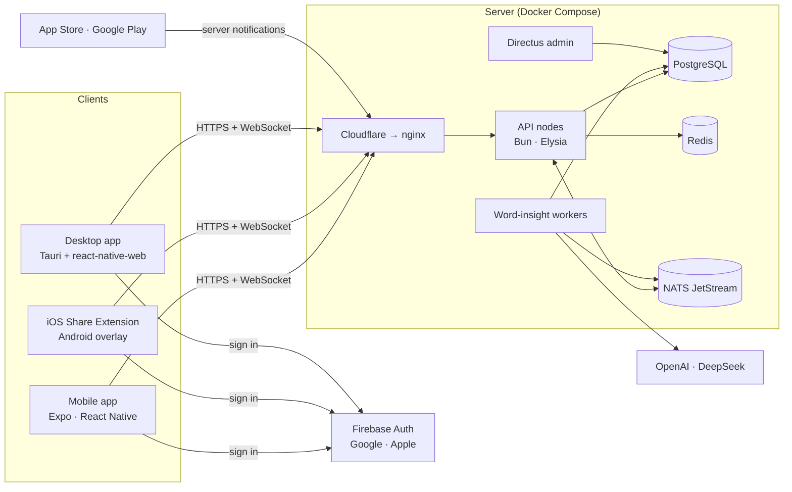
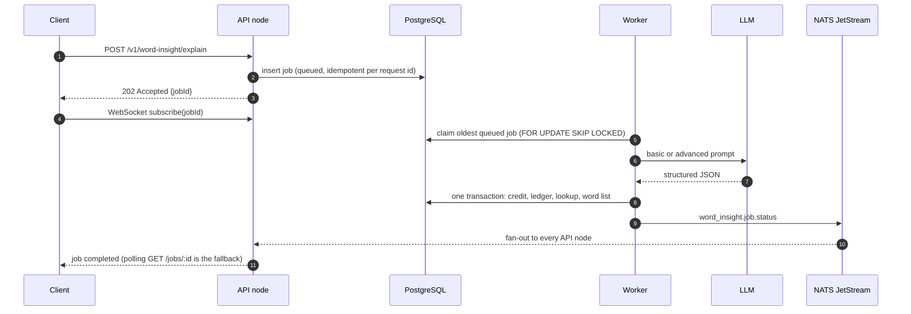

# VocOrbit 🪐

Understand words in real context with AI-powered explanations from the sentences you read. Save important words, review them later, and turn them into daily practice sessions.

### About this project

- **Problem:** You meet an unknown word while reading, look it up, get a generic dictionary meaning,
  and forget it a few days later.
- **Solution:** Look the word up where you read it, get the meaning that fits that sentence in your
  own language, save it, and review it until it sticks.
- **My role:** I designed the product and the architecture, and built it end to end by directing AI
  coding agents. I wrote the specs, reviewed every change and verified it with tests and automated
  architecture checks.
- **Outcome:** Shipped on iOS, Android and desktop and ran in production. When it didn't reach the
  traction I was aiming for, I shut it down and published the code as a case study.

| Part | Path | Stack |
| --- | --- | --- |
| API and background workers | [`apps/api`](apps/api), [`modules`](modules), [`infra`](infra), [`packages/core`](packages/core) | Bun, Elysia, PostgreSQL, Redis, NATS JetStream |
| Admin panel | [`apps/directus`](apps/directus) | Directus on the same PostgreSQL database |
| Mobile app (iOS, Android) | [`apps/mobile`](apps/mobile) | Expo SDK 54, React Native 0.81, native Swift and Kotlin share integrations |
| Desktop app (macOS, Windows, Linux) | [`apps/desktop`](apps/desktop) | The React Native code rendered with react-native-web, wrapped in a Tauri 2 shell |
| Production deployment | [`deployment`](deployment) | Docker Compose, nginx behind Cloudflare, OpenTelemetry, Prometheus, Loki, Grafana |

## Features

**Capturing words**
- iOS Share Extension and an Android text-selection overlay: select text in any app, tap a word and
  see its meaning without leaving that app.
- Desktop quick lookup: copy text anywhere, press a global shortcut (`Cmd/Ctrl+Shift+L` by default)
  and pick the word in a small floating window.
- In-app search and capture.

**Understanding words**
- Two lookup modes. *Basic* returns the meaning in context, a short explanation and phonetics.
  *Advanced* adds example sentences, synonyms, antonyms, collocations, alternative meanings and usage
  notes.
- Explanations follow the user's language pair: native language (L1) and target language (L2).
- The interface is translated into 17 languages.

**Practicing**
- A personal word list with favorites, learned words, collections (groups) and "report a wrong
  meaning".
- Server-generated exercises: meaning match, guess the word, fill in the gap, match synonyms.
- Listen & say pronunciation practice.
- Daily smart review with a spaced-repetition schedule and reminder notifications.
- Weekly mastery analytics, streaks and achievements.

**Running the product**
- Credits: free starter credits, subscriptions through the App Store and Google Play, and credit
  rewards for announcements and referrals.
- Recommended and forced app updates, configured on the server.
- Announcements and in-app tutorial videos, managed from the admin panel.

## Repository layout

```text
.
├── apps/
│   ├── api/          # Composition root: dependency wiring, routes, middleware, job runner, WebSocket hub
│   ├── directus/     # Admin panel environment templates
│   ├── mobile/       # Expo / React Native app, config plugins, iOS project
│   └── desktop/      # react-native-web build of the app + Tauri shell (src-tauri/)
├── modules/          # Business modules: users, social-auth, word-insight, exercises, billing, app-meta
├── infra/            # Adapters: database (SQL migrations, repositories), ai, auth, billing, events, redis, cache, logger
├── packages/core/    # Shared primitives: env validation, errors, HTTP middleware, response helpers
├── deployment/       # Production compose file, nginx, observability stack, operations scripts
├── scripts/          # Architecture boundary check, smoke test client, end-to-end flow script
└── .github/workflows # Server CI and desktop release
```

## Architecture



### Backend: a modular monolith

The API is one deployable service, split into modules with strict boundaries:

- `apps/api` only wires things together (`composition.ts` is a hand-written dependency container)
  and mounts routes.
- `modules/*` hold the business logic. Every module has the same shape: `domain/`, `ports/`,
  `use-cases/`, `http/` and a `public-contract.ts`. Use-cases do not import the HTTP framework.
- `infra/*` implement the ports: PostgreSQL repositories (Drizzle ORM), Redis, NATS, Firebase Admin,
  JWT, the LLM providers and the App Store / Google Play verifiers.
- `packages/core` contains cross-cutting code: environment validation, errors, HTTP middleware.

Cross-module calls go through public contracts wired in `composition.ts`; asynchronous communication
goes through events. [`scripts/check-boundaries.ts`](scripts/check-boundaries.ts) runs in `bun run lint`.
It fails when a module imports infrastructure code or another module's use-cases or HTTP layer, or
when a use-case imports the web framework.

| Module | Responsibility |
| --- | --- |
| `users` | Profiles, roles, language preferences, referral codes |
| `social-auth` | Firebase sign-in, API access and refresh tokens, sessions, App Store review login |
| `word-insight` | Lookups and the job queue, credits and ledger, word list, collections, issue reports, mastery summary |
| `exercises` | Practice catalog, session generation, answers and scoring, weekly analytics |
| `billing` | Receipt verification, store webhooks, SKU catalog, subscription state |
| `app-meta` | App bootstrap (update gating), announcements and rewards, tutorial videos |

### Word lookups: queue, workers and WebSocket updates



- The prompt sends the user's sentence as data inside a JSON payload and asks for schema-constrained
  JSON back. The response is parsed, validated, length-limited and sanitized. A red-team test suite
  covers prompt-injection attempts.
- For basic lookups the apps first call a synchronous endpoint (`/explain/direct`) and fall back to
  the queue.
- Workers run inside the API process or as separate `worker:word-insight` processes. `SKIP LOCKED`
  lets any number of workers share the queue.
- Queue depth, wait times and throughput are exported on `/metrics`.

### Events, auth, billing and admin

- **Transactional outbox:** domain events, such as user changes, are written to `outbox_events` in
  the same transaction as the data. A publisher then forwards them to NATS JetStream. Without
  `NATS_URL`, development falls back to an in-memory bus.
- **Authentication:** clients sign in with Google or Apple through Firebase. The API exchanges the
  Firebase ID token for its own short-lived access token and a rotating refresh token, stored as a
  hash in PostgreSQL. Sessions can be revoked, and every request is checked against the session.
- **Billing:** purchases are verified on the server (App Store signed transactions checked against
  Apple's root certificates, Google Play purchase signatures) and credits are granted once per billing
  cycle. Store webhooks keep renewals, cancellations and refunds in sync.
- **Admin:** Directus runs on the same database. The API's SQL migrations own the schema and also ship
  the Directus collection and permission setup, so the admin panel is reproducible.
- **Observability:** request IDs, structured JSON logs with redaction, OpenTelemetry traces, and
  Prometheus metrics. Local Compose includes Jaeger. The production observability profile adds
  Prometheus, Loki and two Grafana dashboards.

### Security defaults

- Security headers (CSP, frame and content-type protection, HSTS in production), a CORS allowlist
  that denies by default, and a 1 MB body limit.
- Redis-backed rate limiting, plus a per-user lock that blocks concurrent lookup requests.
- Request validation, HTML sanitization of text input, and log redaction of credentials and tokens.
- Resources that belong to another user return `404`.
- Google Play notifications are accepted only from the configured Pub/Sub push service account and
  audience. User identity is never taken from message attributes.
- A Firebase identity is linked to an account by email only when the provider has verified that
  email.

### Mobile app

- Expo SDK 54 with the New Architecture, based on the Ignite boilerplate. State lives in React
  context and MMKV. The main feature screens follow a Screen / View / ViewModel split.
- An API client with automatic token refresh, and word-insight results delivered over WebSocket with
  polling fallback.
- Native parts are provided by custom Expo config plugins in
  [`apps/mobile/plugins`](apps/mobile/plugins): the SwiftUI Share Extension and the Kotlin share
  receiver and overlay. They share the session with the app through the keychain and native storage.
- In-app purchases (`expo-iap`), local review reminders (`expo-notifications`), text-to-speech and
  recording, Crashlytics.
- Type-checked translation keys for 17 locales.

### Desktop app

- The mobile codebase rendered with react-native-web. Platform differences live in `.web.tsx` files:
  browser storage instead of MMKV and keychain, sign-in pages, a read-only credits screen (purchases
  happen on the phone).
- A Tauri 2 shell ([`apps/desktop/src-tauri`](apps/desktop/src-tauri)) adds the global quick-lookup
  shortcut, clipboard access and a `vocorbit-desktop://` deep link. Sign-in runs in the system
  browser, which hands the Firebase token back through the deep link.
- Release builds load the hosted web app, so interface updates ship with a Firebase Hosting deploy.
  Native bundles are built by the `desktop-release` workflow.

## Getting started

**Prerequisites:**
- Bun 1.3 or newer
- Docker with Compose v2
- Node.js 20 or newer (for the Expo tooling)
- Xcode or Android Studio for the mobile app, and a Rust toolchain for the desktop shell
- A Firebase project with Google/Apple sign-in
- An OpenAI or DeepSeek API key

### Backend

Copy the environment templates, then set these values in `.env`:
- `JWT_SECRET`
- `FIREBASE_PROJECT_ID`, plus a service account: `FIREBASE_SERVICE_ACCOUNT_JSON`, or
  `FIREBASE_CLIENT_EMAIL` and `FIREBASE_PRIVATE_KEY`
- `OPENAI_API_KEY`, or `WORD_INSIGHT_PROVIDER=deepseek` with `DEEPSEEK_API_KEY`

```bash
cp .env.example .env
cp apps/directus/.env.example apps/directus/.env   # docker-compose.yml needs this file
```

Then install, start the services and run the API:

```bash
bun install
docker compose up -d postgres redis nats           # add directus / jaeger otel-collector if needed
bun run migrate
bun run dev                                        # http://localhost:3000, OpenAPI at /openapi
```

Redis must be reachable, because the API stops at startup without it. The admin panel is at
http://localhost:8055. Start `directus` before the first `bun run migrate`: the migrations that
configure it only take effect once Directus has created its own tables.

To run lookups in separate worker processes:

```bash
WORD_INSIGHT_JOB_RUNNER_ENABLED=false bun run dev
bun run worker:word-insight
```

### Mobile app

1. Download `GoogleService-Info.plist` and `google-services.json` from your Firebase project. The
   `*.example` files show the expected shape.
2. Place them in `apps/mobile`, and copy the plist to `ios/VocOrbit/` as well.
3. Optionally copy `.env.example` to `.env` for overrides.
4. Install and run:

```bash
cd apps/mobile
bun install
bun run ios        # or: bun run android
```

Store builds use EAS (`bun run build:ios:prod`, `bun run build:android:prod`). EAS respects
`.gitignore`, so the Firebase files have to be provided to it explicitly, for example as EAS file
environment variables.

### Desktop app

```bash
cd apps/desktop
bun install
bun run web                 # browser only: Expo web on http://localhost:5055
bun run desktop:app:local   # or: starts the web app and opens it in the Tauri shell
bun run desktop:build       # native bundles
```

The desktop app uses the same Firebase files as mobile. `.env.example` lists the web sign-in
settings. The API's `CORS_ORIGIN` must include the web origin (`http://localhost:5055` in
development). To publish the web app to Firebase Hosting, run `bun run hosting:deploy:desktop`.

## Quality checks

| Command | What it does |
| --- | --- |
| `bun run lint` | Biome plus the architecture boundary check |
| `bun run typecheck` | Strict TypeScript |
| `bun run test` | Unit and HTTP tests; PostgreSQL-backed integration tests run when `TEST_DATABASE_URL` is set |
| `bun run test-client` | Smoke test of sign-in and protected endpoints against a running API |
| `bun run e2e:agenda` | End-to-end flow against a running API: sign-in, lookups, word list, billing, token lifecycle |
| `bun run test` / `lint` / `compile` / `depcruise` in `apps/mobile` or `apps/desktop` | Jest, ESLint, TypeScript and dependency rules for the apps |

`.github/workflows/ci.yml` runs migrations, lint, type-check and tests against PostgreSQL and Redis
service containers.

## Deployment

[`deployment/`](deployment) is the production baseline:

- **Compose file:** [`deployment/compose/docker-compose.prod.yml`](deployment/compose/docker-compose.prod.yml).
  - nginx sits in front of two API containers, with Cloudflare origin TLS, real client IPs, per-IP
    rate limiting and WebSocket upgrades.
  - PostgreSQL, Redis and NATS run on a private network.
  - Optional profiles: `workers`, `admin` (Directus) and `observability` (OpenTelemetry Collector,
    Jaeger, Prometheus, node-exporter, cAdvisor, Loki, Promtail, Grafana).
- **Image:** [`deployment/docker/Dockerfile.prod`](deployment/docker/Dockerfile.prod) builds the API,
  worker and migration bundles and runs them as a non-root user.
- **Scripts:** `bootstrap_single_server.sh` prepares a fresh Ubuntu host (firewall, fail2ban, Docker,
  generated secrets) and deploys. `migrate.sh`, `deploy.sh`, `backup_postgres.sh`,
  `restore_postgres.sh` and `update_cloudflare_real_ip.sh` handle day-to-day operations.
- **Settings:** [`deployment/env/.env.prod.example`](deployment/env/.env.prod.example) is the
  template. Google Play webhooks are only accepted once `BILLING_GOOGLE_PUBSUB_AUDIENCE` and
  `BILLING_GOOGLE_PUBSUB_SERVICE_ACCOUNT_EMAIL` match the Pub/Sub push subscription.

## Known limitations

- Failed lookup jobs are final. Retry with backoff, a dead-letter queue and separate priorities for
  basic and advanced jobs are the planned next steps.
- WebSocket heartbeats use a timer per socket. A single sweep timer is planned for very high
  connection counts.
- Deployment targets a single host; multi-region support is prepared but not deployed.
- Spaced-repetition progress is stored on the device and not synced to the server.
- The desktop app branched from mobile 1.0.10 and does not have the later mobile features yet.
  Desktop installers are not code-signed.
